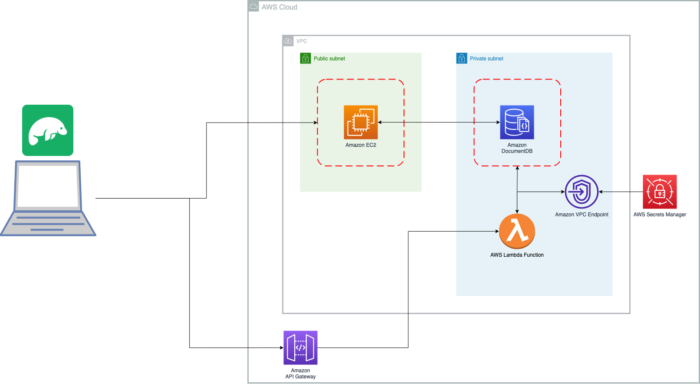

# Getting started with Amazon DocumentDB

This project setups a simmple single instance [Amazon DocumentDB](https://aws.amazon.com/documentdb/) (DocumentDB) cluster using AWS CDK. The project uses Nested Stacks. Please edit the `config.json` file to changes names of resources as required.

1. [`lib/aws_doc_db-stack.ts`](./lib/aws_doc_db-stack.ts) is the file that has the primary stack. This file invokes the necessary nested stacks.

2. [`lib/nw_resources.ts`](./lib/nw_resources.ts) creates a VPC with 2 Availability Zones (AZs), and two Subnets - a Public Subnet and a Private Isolated Subnet. It also creates a default EC2 instance in the Public Subnet. The EC2 instance can be eliminated for production. This is useful to check connectivity with DocumentDB cluster. Also note that this stack sets up a VPC Endpoint for Secrets Manager in the Private Subnet. This facilitates the Lambda function (see below) being able to access the database secret (i.e. password for the cluster) without needing an Internet connection.

3. [`lib/docdb.ts`](./lib/docdb.ts) creates a single instance DocumentDB cluster. You have to pass the VPC and Security Group to this stack when invoked from [`lib/aws_doc_db-stack.ts`](./lib/aws_doc_db-stack.ts). By default the instance type is type R5, Large. Change it in the `docdb.ts` stack. Note that like other resources, the removal policy for this cluster is set to `DESTROY` upon deletion of the stack. TLS connection is enabled by default. The username to be used with DocumentDB is specified in `config.json`. Password will be automatically generated by [AWS Secrets Manager](https://aws.amazon.com/secrets-manager/). See notes above on Secret Manager VPC endpoint and the Lambda function below.

4. [`lib/testDocDB.ts`](./lib/testDocDB.ts) creates resources for testing DocumentDB. It creates a Lambda function in the same Private Subnet where the DocumentDB cluster is created. It also sets up a Rest API with AWS Gateway for testing.

## High Level Architecture Diagram



### Prerequisites

1. An [AWS Account](https://signin.aws.amazon.com/signin?redirect_uri=https%3A%2F%2Fportal.aws.amazon.com%2Fbilling%2Fsignup%2Fresume&client_id=signup)
2. [AWS CDK](https://aws.amazon.com/cdk/) installed and setup. Please note AWS CDK is constantly improved with new versions released frequently. This project is deployed and tested with AWS CDK Version 2.92.0. 
3. Create a Key Pair in the same account/region for your EC2 where you plan to deploy the stack. Update the `config.json` with name of the Key Pair to be used.

## Stack Deployment, Testing & Removal

Please note that this stack is likely to incur cost (it is not free!). Remeber to destroy the stack as shown below. You should be familiar with use `cdk` commands and ensure that the region you are using is `cdk` bootstrapped.

### Deploy

Before you deploy - make sure that you have a Key Pair 
To install, clone the respository and deploy using default AWS credentials:

```bash
cdk deploy 
```

If you prefer to specify your AWS profile for the account/region:

```bash
cdk deploy --profile <your profile name here>
```

### Test

#### Resources
The stack deployment will print out list of resources on the console, here is an example - these outputs will be different for you. This example deployment is for the region `us-west-2` - and resources will also defer:

```bash
Outputs:
AwsDocDbStack.DocumentDBClusterHost = docdb9ca910d2-nymqxctinez9.cluster-cllkdscq0t27.us-west-2.docdb.amazonaws.com
AwsDocDbStack.DocumentDBSecurityGroup = sg-0afa7cb2e8c142467
AwsDocDbStack.EC2PublicIP = <your public IP>
AwsDocDbStack.SecretManagerARN = arn:aws:secretsmanager:us-west-2:<your account number>:secret:<your secret>
AwsDocDbStack.VPC = arn:aws:ec2:us-west-2:<your account number>:vpc/vpc-0e72a7423ac088b8f
AwsDocDbStack.TestAPIGatewayApiUrl = <your url here>/prod/
Stack ARN:
arn:aws:cloudformation:us-west-2:<your account number>:stack/AwsDocDbStack/ffa10cb0-4139-11ee-aa01-0aeb0d938f3f
```
#### DocumentDB Password

To use the EC2 command line and Studio 3T to access the DocumentDB you will need the password. Login to the AWS console, and go to secrets manager. Go to the secret specified by the ARN output by the stack deployment. 

Navigate to Amazon Document DB > Clusters and select the cluster specified by the stack output. You will see examples of connection strings.

And to see example connection strings you can use the DocumentDB console as well. 

#### With EC2

Review the EC2 section below to setup and test with EC2. You can `ssh` into the EC2 instance with the key pair defined.
You can refer to this guide: [Connect Using Amazon EC2](https://docs.aws.amazon.com/documentdb/latest/developerguide/connect-ec2.html))

#### With Studio 3T

Review this guide to test with Studio 3T. Studio 3T will use the EC2 (you will have to configure to use it) to tunnel and connect to the DocumentDB cluster in the private subnet.
[Connecting to an Amazon DocumentDB Cluster from Studio 3T](https://docs.aws.amazon.com/documentdb/latest/developerguide/studio3t.html)

#### cURL | Postman

The [`lib/testDocDB.ts`](./lib/testDocDB.ts) creates an API with simple test CRUD operations - insert and get a document. 

1. Insert Document
You want to first invoke the `POST` call:

```bash
curl --location --request GET 'https://<Your URL>/test'
```
Upon success it will return a Object ID of the created document: 

```bash
"{\"$oid\": \"64e5831cfe2eeacaa0f6a058\"}"
```

2. Take the ID from above and make a `GET` call:

```bash
curl --location --request GET 'https://hz1qnljj07.execute-api.us-west-2.amazonaws.com/prod/test/64e5831cfe2eeacaa0f6a058'
```
Upon success you will see the response:

```bash
"{\"_id\": {\"$oid\": \"64e5831cfe2eeacaa0f6a058\"}, \"name\": \"Amazon DocumentDB\", \"port\": 27017}"
```

### Destroy

After you are done, to destroy the stack:

```bash
cdk destroy
```
### General Notes:

- All or most resources have an removal policy of `DESTROY` applied since this is for learning/testing. If you intend to use this code for production please change the removal policy for resources as needed.
- DocumentDB is deployed as a single instance - for production this should be set to at least 2.

### Resources

1. [Amazon DocumentDB (with MongoDB compatibility) samples](https://github.com/aws-samples/amazon-documentdb-samples)

### Dev EC2 - Testing DocumentDB connectivity and access with Amazon EC2

1. Create an EC2 (see Stack info above) with Amazon Linux 2 in the Public Subnet. Ensure that the ingress firewall is restricted to specific IPs for increased security. SSH into the EC2 with the PEM key that you had selected during the EC2 creation process - you have to specify it in the `config.json` file. The instructions are for Amazon Linux 2, but may work with other versions of Linux as well.

2. Install the Mongo Client (more details on this page [Connect Using Amazon EC2](https://docs.aws.amazon.com/documentdb/latest/developerguide/connect-ec2.html)): 

```bash
# Create the repo file
echo -e "[mongodb-org-4.0] \nname=MongoDB Repository\nbaseurl=https://repo.mongodb.org/yum/amazon/2013.03/mongodb-org/4.0/x86_64/\ngpgcheck=1 \nenabled=1 \ngpgkey=https://www.mongodb.org/static/pgp/server-4.0.asc" | sudo tee /etc/yum.repos.d/mongodb-org-4.0.repo

# install the Mongo Shell
sudo yum install -y mongodb-org-shell
```
3. Install Git Client:

```bash
sudo yum install git
git version
```

3. Install PyEnv and VirtualEnv on Amazon Linux
```bash
# Check & note system versions of Python
python -V
Python 2.7.18

python3 -V
Python 3.7.16

# Install prereqs
sudo yum install gcc zlib-devel bzip2 bzip2-devel patch readline-devel sqlite sqlite-devel openssl-devel tk-devel libffi-devel

# change to home directoy, and install Pyenv
cd ~
git clone https://github.com/pyenv/pyenv.git ~/.pyenv

# Configure your '.bash_profile' file

echo ' ' >> ~/.bash_profile
echo '# Pyenv Configuration' >> ~/.bash_profile
echo 'export PYENV_ROOT="$HOME/.pyenv"' >> ~/.bash_profile
echo 'export PATH="$PYENV_ROOT/bin:$PATH"' >> ~/.bash_profile
echo 'eval "$(pyenv init -)"' >> ~/.bash_profile

# Reinitialise your Shell

source ~/.bash_profile

# Testing pyenv

pyenv

# Configuration

# To prevent any existing system dependencies from breaking, it's a good idea to setup pyenv with versions of the current existing python installations.

# Install matching systrem python versions

pyenv install 2.7.18

pyenv install 3.7.16

# Configure Global python versions

pyenv global 3.7.16 2.7.18
#  Install the virtualenv plug in for Python https://github.com/pyenv/pyenv-virtualenv
git clone https://github.com/pyenv/pyenv-virtualenv.git $(pyenv root)/plugins/pyenv-virtualenv
#  Add to Bash Shell
echo 'eval "$(pyenv virtualenv-init -)"' >> ~/.bashrc
# Install lzma, otherwise you will get this error when installing 3.9.xx with pyenv
Installing Python-3.9.17...
Traceback (most recent call last):
  File "<string>", line 1, in <module>
  File "/home/ec2-user/.pyenv/versions/3.9.17/lib/python3.9/lzma.py", line 27, in <module>
    from _lzma import *
ModuleNotFoundError: No module named '_lzma'
WARNING: The Python lzma extension was not compiled. Missing the lzma lib?

# to install do the following
yum install -y xz-devel

# Now ready to create a Virtual Environment, let's say with Python Version 3.9, first we need to install that
pyenv install 3.9
# Take note of what subversion it installed - in my case it was 3.9.17
# Now create a virtual environment called 'scrapeparse'
pyenv virtual 3.9.17 scrapeparse
# You may have to exit the EC2 SSH and connect back up for virtualenv to work
# activate it, and install pymongo
pyenv activate scrapeparse
pip install pymongo
```